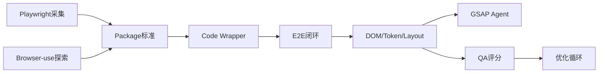

# Code Designer AI — 执行计划任务清单

> [!WARNING]
> **本文档是 2026-09-20 的初版计划拆解，仅作历史决策记录。**
>
> 两处路线已变更，请勿据此开发：
> 1. `browser-use` 网页探索 **已否决** —— 与 Next.js + TypeScript 技术栈不符，
>    Phase 1 改为 **Playwright 自研 Intelligence Layer**。
> 2. 流水线已新增 **WebsitePackage 中间层** 与 **Animation Agent**，本文档未覆盖。
>
> **当前架构以根目录 [`ARCHITECTURE.md`](../ARCHITECTURE.md) 为准。**


> 来源：`Code_Designer_AI_Web_Reverse_Engineering_Execution_Plan.docx`（2026-09-20）  
> 项目：`C:\Users\Wuu\Desktop\8.4CodeAi`  
> 用途：把执行计划拆成可开发、可验收的任务。状态标记：`[ ]` 未开始 / `[~]` 进行中或部分实现 / `[x]` 已完成。

---

## 0. 目标流水线（对齐执行计划）

```
URL
  → Browser-use 网页探索 Agent
  → Playwright 精确采集 Agent
  → Website Intelligence Package（统一数据包）
  → screenshot-to-code 代码生成（经数据包 Wrapper）
  → GSAP Animation Agent 动效恢复
  → Playwright QA + Vision 评分闭环
```

系统定位：不是「截图生成工具」，而是 **AI Web Reverse Engineering Platform**。

---

## 1. 现状对照（写清单时的代码基线）

| 计划模块 | 代码基线 | 状态 |
|---------|---------|------|
| 多 Agent Pipeline 骨架 | `src/lib/agents/pipeline.ts`（Capture → Vision → Design → Component/Code → Review → Optimize） | `[~]` 已有编排，与计划 Agent 划分不完全一致 |
| WebsitePackage 类型 | `src/lib/agents/types.ts` 中 `WebsitePackage` | `[~]` 有内存结构，缺磁盘目录标准与独立 JSON Schema |
| 网页采集 | `captureAgent.ts` + `website-scraper.ts`（HTTP） | `[~]` HTTP 抓取可用；Browser-use 未接入 |
| Playwright 工程采集 | `PipelineConfig.enablePlaywright` 默认 `false`；`screenshot.ts` 使用 `puppeteer-core` | `[~]` 开关/截图雏形，非计划中的 Playwright 工程采集 |
| Browser-use 探索 Agent | 无依赖、无封装 | `[ ]` 未实现 |
| screenshot-to-code 外部流水线 | 仓库内 LLM 代码生成（`mimo.ts` / prompts） | `[~]` 能生成代码，但未按计划以 Intelligence Package 为强制输入 Wrapper |
| GSAP 动效恢复 Agent | 仅官网 UI 使用 GSAP；`AnimationData` 类型存在 | `[ ]` 生成项目侧动效恢复未实现 |
| 视觉评分 | `src/lib/visual-evaluation/`（layout / visual_balance / spacing / color / typography / premium） | `[~]` 有闭环雏形；计划指标含 `animation_score`，当前用 `premium_score` 替代 |
| 优化循环 | `optimizeAgent.ts` + `enableAutoOptimization` | `[~]` 有轮次与 targetScore，缺与生成页 Playwright 截图对比的强制链路 |
| 产品侧能力 | Auth / Admin / Quota / Export / Docker / Prisma | `[x]` 平台底座已较完整，非本计划主线缺口 |

---

## 2. 全局执行约束（所有任务必须遵守）

| ID | 约束 | 验收方式 |
|----|------|---------|
| C1 | 模块之间 **只通过 JSON Schema 定义的数据包通信**，禁止 Agent 间直接塞临时对象 | 每个产出物有 schema 文件 + 校验函数；集成测试能校验 |
| C2 | 代码生成 **必须** 输入 Website Intelligence Package，禁止只喂单张截图 | Code Agent Wrapper 入参 schema 校验失败时拒绝执行 |
| C3 | 动效恢复 **独立成 GSAP Agent**，不并入代码生成 | 单独模块/进程可单独跑；代码生成 prompt 不混入 GSAP 细节 |
| C4 | Phase 1 优先打通 **数据链路**，不先堆复杂 Agent | Phase 1 DoD 以「URL → 可落盘数据包 → 可编译项目」为准 |
| C5 | 采集与 QA 使用真实浏览器能力（Playwright）；探索可选 Browser-use | 环境中可 `npx playwright --version`；CI/本地有可复现命令 |

---

## 3. Phase 1 — URL → React 页面闭环（数据链路优先）

**阶段目标**：给定一个 URL，产出结构化 Intelligence Package，并生成可 `npm install && npm run dev` 的 Next.js + React + Tailwind 项目。

### 3.1 Browser-use 网页探索 Agent

| 任务 ID | 任务 | 输入 | 输出 | 验收标准 |
|---------|------|------|------|---------|
| P1-01 | 调研并锁定 browser-use 集成方式（Python 服务 or Node 调用） | GitHub `browser-use/browser-use`；目录 `browser_use/agent` / `browser` / `dom` | 技术选型说明（路径、依赖、运行方式） | 选型文档写明：依赖安装、进程模型、与 Next.js 的调用边界 |
| P1-02 | 封装 `BrowserExploreAgent` | URL | `browser-result/`：`screenshots/`、`browsing_history.json`、`dom_raw.json` | 给定示例 URL 能生成上述文件；失败有明确错误日志 |
| P1-03 | 探索任务脚本化：打开页面、滚动、点击菜单/按钮、截取交互状态、粗读 DOM | 目标 URL + 探索策略配置 | 浏览历史含 action 序列（scroll/click） | history JSON 中 action 可回放描述；截图覆盖首屏与滚动后关键视口 |
| P1-04 | 定义 `browser-result` 与 Intelligence Package 的映射 | `dom_raw.json`、screenshots | 映射规则 / 转换函数 | 未接入 Playwright 前，Package 也能填入探索级 DOM/截图 |

### 3.2 Playwright 精确采集 Agent

| 任务 ID | 任务 | 输入 | 输出 | 验收标准 |
|---------|------|------|------|---------|
| P1-05 | 引入 Playwright，替换/补齐 `puppeteer-core` 作为工程采集依赖 | 项目 `package.json` | 可调用的采集运行时 | Windows 下 `next dev` 环境可无报错启动 Chromium 采集 |
| P1-06 | 实现 `PlaywrightCaptureAgent`：完整页截图、元素坐标/尺寸/层级、DOM Snapshot | URL（或 Browser-use 标记的关键视口） | `playwright-result/`：`screenshots/`、`element.json`、`styles.json`、`animation_raw.json` | 产物齐全；`element.json` 含 selector、box、zIndex/层级信息 |
| P1-07 | CSS 属性提取：颜色、字体、间距、圆角、阴影、CSS 变量 | DOM + Computed Style | `styles.json` / StyleAnalysis 字段 | 与现有 `WebsitePackage.styles` 字段对齐并回填 |
| P1-08 | 动画状态检测：transition / animation / transform / ScrollTrigger 线索 | 页面运行时样式与脚本观察 | `animation_raw.json` | 至少能识别 CSS transition/keyframe；GSAP 相关 class/attr 尽力标记 |
| P1-09 | 将 `PipelineConfig.enablePlaywright` 默认打开或提供生产可开关的采集 profile | `pipeline.ts` 配置 | 配置项 + 文档 | 生成任务默认走工程采集；关闭时有降级路径并告警 |

### 3.3 Website Intelligence Package 数据标准

| 任务 ID | 任务 | 输入 | 输出 | 验收标准 |
|---------|------|------|------|---------|
| P1-10 | 定义磁盘数据包目录标准 | 执行计划 §五 | `website-package/` 规范：<br>`screenshots/` `dom/` `styles/` `assets/` `layout/` `interaction/` + 核心 `package.json`/`manifest.json` | 目录结构与计划一致；README 可指导人工检查 |
| P1-11 | 编写核心 JSON Schema | 字段：`url` `screenshots` `dom` `layout` `design_tokens` `assets` `interaction` | `src/lib/schema/website-package.schema.json`（或等价路径） | Schema 可被校验库加载；样例包通过校验 |
| P1-12 | 实现 Package Assembler：Browser-use + Playwright 产物 → 统一包 | 各采集输出 | Assembler 模块 + 磁盘落盘 | 单次任务生成完整 `website-package/`；缺字段能标 `partial: true` |
| P1-13 | 与现有 `WebsitePackage` TypeScript 类型对齐/迁移 | `src/lib/agents/types.ts` | 更新后的类型 + 兼容适配层 | 旧 Pipeline 仍可跑；新类型成为权威 |
| P1-14 | 包版本与可追溯字段 | 采集任务 ID、时间、工具版本 | `manifest`：`schemaVersion`、`toolVersions`、`sourceUrl`、`capturedAt` | 同一 URL 两次采集可对比 manifest |

### 3.4 screenshot-to-code 接入（Code Agent Wrapper）

| 任务 ID | 任务 | 输入 | 输出 | 验收标准 |
|---------|------|------|------|---------|
| P1-15 | 调研 `abi/screenshot-to-code` 接入方式（fork / 服务调用 / 算法移植到现有 LLM 生成） | GitHub 仓库与现有 `src/lib/mimo.ts` | 接入方案决策记录 | 明确是外部进程还是内置 Agent；成本与依赖写清 |
| P1-16 | 实现 `CodeAgentWrapper`，强制消费 Intelligence Package | `website-package/` | Next.js + React + Tailwind 工程 | Wrapper 单测：非法/空包必须失败；合法包产出可安装工程 |
| P1-17 | 生成工程最低交付物 | Package | `package.json`、`app/` 或 `pages/`、Tailwind 配置、主页面组件、静态资源引用 | `npm install && npm run build`（或 dev）在干净目录可启动 |
| P1-18 | 禁止「仅截图」捷径 | — | 入参校验 + 日志 | 日志显示使用了 dom/layout/design_tokens；无截图-only 路径 |

### 3.5 Phase 1 导出与演示闭环

| 任务 ID | 任务 | 输入 | 输出 | 验收标准 |
|---------|------|------|------|---------|
| P1-19 | 端到端脚本/接口：URL → Package → 项目 ZIP | 用户 URL | 工作流 API 或 CLI（可复用 `api/workflow` / `export-project`） | 一次点击/命令完成；产物含 package 与工程 |
| P1-20 | Phase 1 验收样例（≥3 个站点） | 简单落地页、中等营销站、带导航交互页 | 三组 package + 生成工程 + 启动截图 | 三个样例均能本地启动；主结构与原站区块对应 |
| P1-21 | Phase 1 文档：运行手册与故障排查 | — | `docs/phase1-runbook.md`（或并入 README） | 新环境按文档可复现；列出缺失浏览器/端口/DB 依赖 |

**Phase 1 DoD**

- [ ] C1–C5 全部满足  
- [ ] 三个样例站点端到端成功  
- [ ] `website-package` 通过 schema 校验  
- [ ] 生成项目可安装可启动  
- [ ] 未要求 GSAP/QA 自动改分达到生产级（属 Phase 3）

---

## 4. Phase 2 — 提升视觉还原

**阶段目标**：提高 Design Token、布局与资源还原质量，使生成页与原站的结构/配色/字体更接近。

| 任务 ID | 任务 | 输入 | 输出 | 验收标准 |
|---------|------|------|------|---------|
| P2-01 | DOM 深度分析 Agent（语义区块、组件边界、重复模式） | `dom/` | `layout/sections.json` 等 | Hero/Nav/Feature/Footer 等角色标注准确率在样例集人工抽检可接受 |
| P2-02 | Design Token 提取 Agent | `styles.json` + 截图 | `design_tokens.json`（颜色角色、字号阶梯、间距、圆角、阴影、动效曲线） | Token 可直接映射到 Tailwind theme |
| P2-03 | Assets 提取与本地化 | 页面资源 URL | `assets/` + manifest（宽高、类型、hash） | 生成项目引用本地资源路径；防盗链失败时有占位策略 |
| P2-04 | Layout Agent：盒模型与栅格还原 | 截图 + element.json + tokens | `layout/grid.json`、断点策略 | 生成页在 desktop/tablet/mobile 关键断点不塌陷 |
| P2-05 | 将 Phase 2 产物回填 Intelligence Package 与 Code Wrapper | Package v2 | Wrapper prompt/上下文更新 | 同一样例 Phase1 vs Phase2 生成结果有可对比评分提升 |
| P2-06 | 响应式与图片适配检查 | 生成工程 | QA 静态检查项 | 无明显横向滚动；主图不拉伸变形 |

**Phase 2 DoD**

- [ ] design_tokens / assets / layout 进入 Package schema  
- [ ] 样例集视觉评分（至少 layout/color/typography/spacing）相对 Phase 1 提升  
- [ ] 生成工程不依赖失效外链图片  

---

## 5. Phase 3 — 高级能力（GSAP / QA / 自我迭代）

**阶段目标**：恢复交互动效，并建立自动视觉评分与优化闭环。

### 5.1 GSAP 动效恢复系统

| 任务 ID | 任务 | 输入 | 输出 | 验收标准 |
|---------|------|------|------|---------|
| P3-01 | 定义 `animation.json` Schema（进入动画、滚动触发、缩放、Parallax、Reveal） | 执行计划 §七 + `AnimationData` | Schema + 样例 | 样例通过校验 |
| P3-02 | `GsapAnimationAgent`：分析 animation_raw → 结构化动画规格 | `animation_raw.json`、交互探索记录 | `animation.json` | 能输出至少 entrance + scroll 两类（若原站存在） |
| P3-03 | 生成 React + GSAP 组件（含 ScrollTrigger 注册） | `animation.json` + 组件树 | `components/animations/*` 或等价文件 | 生成项目编译通过；`gsap.registerPlugin(ScrollTrigger)` 规范 |
| P3-04 | 动效与代码生成解耦集成 | Pipeline | 独立阶段可跳过/重跑 | 关闭 GSAP 阶段不影响静态页生成 |
| P3-05 | 动效验收：与原站对比录屏/关键帧 | 原站 / 生成页 | 对比记录 | 至少 Hero 入场与一个滚动动画可观察到对应行为 |

### 5.2 QA 自动优化循环

| 任务 ID | 任务 | 输入 | 输出 | 验收标准 |
|---------|------|------|------|---------|
| P3-06 | 对齐评分指标 | 计划：layout / visual_balance / spacing / color / typography / **animation** | 更新 `visual-evaluation` 指标（补 `animation_score`，明确是否保留 `premium_score`） | 指标字典与文档一致；评分 JSON schema 更新 |
| P3-07 | Playwright 对生成页自动截图 | 生成工程 + 原站截图 | `qa/shots/generated/*.png` | 与原站同视口宽度可对比 |
| P3-08 | Vision 模型打分与问题清单 | 原图 vs 新图 + 指标 prompt | `VisualEvaluation`（分数 + issues + suggestions） | 结果可 JSON 校验；issues 带 dimension/severity/fix |
| P3-09 | 优化改代码循环 | evaluation + generated code | OptimizeAgent 修订代码 | 分数提升或达到 `targetScore`/`maxOptimizationRounds` 停止 |
| P3-10 | 自我迭代策略：收敛检测、防震荡、失败降级 | 轮次历史 | 决策逻辑 + 日志 | 连续两轮无提升则停止并输出报告 |
| P3-11 | QA 报告产物 | 整次任务 | `qa-report.json` + 人读摘要（HTML/MD） | 可从 Admin 或项目详情查看（可接现有 analysis 页面） |

**Phase 3 DoD**

- [ ] GSAP Agent 独立可跑，C3 满足  
- [ ] 评分含 animation 维度或有书面兼容说明  
- [ ] 至少 1 个动效样例完成「生成 → 截图 → 评分 → 优化 → 复测」闭环  
- [ ] 优化循环有明确停止条件与报告  

---

## 6. 跨阶段支撑任务

| 任务 ID | 任务 | 阶段建议 | 验收标准 |
|---------|------|---------|---------|
| S-01 | 统一 Agent 接口：`execute(input, context) → AgentResult` | P1 | 所有新旧 Agent 可被 Pipeline 以同一方式编排 |
| S-02 | Schema 仓库：`src/lib/schemas/` + 校验工具 + fixtures | P1 | `npm run test:schema` 或 vitest 覆盖通过/失败用例 |
| S-03 | 任务产物存储约定：本地 `runs/<jobId>/website-package/...` | P1 | 一次 run 目录可完整归档/上传 |
| S-04 | 模型可插拔：采集摘要/Vision/Code/QA 可分模型配置 | P1–P2 | 配置改动无需改代码硬编码 |
| S-05 | 可观测：Pipeline 进度事件、耗时、token 成本 | P1 | Admin 现有 monitor/logs 能看到阶段事件（可渐进） |
| S-06 | 安全：URL SSRF、下载资源大小/类型限制、密钥不进前端 | P1 | 恶意 URL/超大资源被拒绝；密钥仅服务端 |
| S-07 | 回归样例集：固定 URL 列表 + 期望区块清单 | P2–P3 | CI 或手动脚本可重复跑并输出对比表 |
| S-08 | Windows 本地开发说明（当前环境） | P1 | 记录 node 路径、docker（`cda-db`:5433、`cda-redis`:6380）、预览端口 3111、Chromium 依赖 |

---

## 7. 建议排期与优先级

| 优先级 | 任务簇 | 说明 |
|--------|--------|------|
| P0 | P1-05 ~ P1-14, S-02, S-03, S-06 | 工程采集 + 数据包标准 + Schema，是后面一切的前提 |
| P0 | P1-15 ~ P1-18, P1-19 | 代码生成必须挂到数据包上 |
| P1 | P1-01 ~ P1-04 | Browser-use 探索增强（可与 P0 并行，但不要阻塞 P0 闭环） |
| P1 | P2-01 ~ P2-05 | 还原质量 |
| P2 | P3-01 ~ P3-05 | 动效独立交付 |
| P2 | P3-06 ~ P3-11, S-07 | QA 自动优化 |

依赖关系简图：



---

## 8. 任务状态跟踪（维护区）

开发时请把对应项改为 `[~]` / `[x]`，并在下方追加日期与备注。

| 任务 ID | 状态 | 负责人 | 更新日期 | 备注 |
|---------|------|--------|----------|------|
| P1-01 | [ ] | | | |
| P1-05 | [ ] | | | 现有 puppeteer-core 截图路径需评估去留 |
| P1-06 | [x] | Wxx | 2026-09-26 | `element.json` 的 zIndex/层级信息已补齐（`layout-probe.ts` → `LayoutBlock.zIndex`，schema 1.3.0）。`auto` 记为**字段缺失**而非 0 —— auto 与 0 是两种层叠语义，折算等于编造测量值 |
| P1-10 | [x] | Wxx | 2026-09-26 | 目录标准落地：`runs/<jobId>/website-package/{manifest.json,package.json,screenshots/,dom/,styles/,assets/,layout/,interaction/}`；`interaction/` 仅在真有内容时创建；截图 base64 拆成真实文件 |
| P1-11 | [x] | Wxx | 2026-09-26 | `src/lib/schemas/website-package.schema.json`（draft 2020-12，闭集契约）+ `json-schema.ts` 零依赖校验器。未知关键字**报错而非静默通过** |
| P1-14 | [x] | Wxx | 2026-09-26 | manifest 含 `sourceUrl` / `capturedAt` / `schemaVersion` / `toolVersions` / `jobId` / `counts`，两次采集可直接对表 |
| P1-15 | [ ] | | | 决策：fork / 服务 / 内置 LLM |
| P1-16 | [x] | Wxx | 2026-09-26 | `gatePackageForStep`：契约违约 → `ok:false`（`/api/mimo` code 步骤返回 422 `PACKAGE_CONTRACT_VIOLATION`）；合法但空包 → 放行 + 告警（不把空当非法） |
| P1-18 | [x] | Wxx | 2026-09-26 | 每次 code 步骤打印「已注入数据包块: …」；`BLOCK_LABELS` 单点维护标签，杜绝两处标签不一致导致「看着注入了其实没有」 |
| P2-03 | [x] | Wxx | 2026-09-26 | `src/lib/assets/`：零依赖图片头解析（PNG/JPEG/GIF/BMP/WebP/SVG）+ 本地化落盘 + manifest（宽高/类型/sha256）+ 防盗链重试（补 Referer）+ **占位策略**（403/超大/超时/软404 一律落本地占位 SVG）。`npm run verify:assets` 真 HTTP 验收 15/15 |
| P3-06 | [x] | Wxx | 2026-09-26 | 见 `docs/P3-06-animation-score-compatibility.md`：书面说明为何 `premium_score` **不能**改名为 `animation_score`（跨义合并），并给出动效实际被采集/归档的四层链路。本轮 QA 权重冻结，故不改分 |
| P3-08 | [x] | Wxx | 2026-09-26 | `QaReport.problems` 保留模型原始 `severity`/`priority`/`reason`/`solution`（不压扁成 `{type,description}`），`dimension` 只做同义映射 |
| P3-11 | [x] | Wxx | 2026-09-26 | `src/lib/visual-evaluation/report.ts` + `src/lib/qa-report.ts`：`runs/<jobId>/qa-report.json` + `qa-report.md`（人读）+ 一行 `[QA-REPORT]` 结构化日志。`trustworthy` 是一等字段 |
| S-02 | [x] | Wxx | 2026-09-26 | `src/lib/schemas/` + `json-schema.ts` + `__fixtures__/substantive-package.json`；`npm run test:schema` 27 例、`npm run verify:schema` **15/15**（含「undefined 等价于缺失」与「真实生产者 `buildWebsitePackage()` 输出过契约」两项） |
| S-03 | [x] | Wxx | 2026-09-26 | `src/lib/run-artifacts.ts` 收敛「一个开关 + 一个根目录 + jobId 消毒 + 写文件原语」；`RUN_ARTIFACTS=on`（兼容旧 `PACKAGE_ARCHIVE`），默认 off |

### 2026-09-26 追加说明

- **本轮补的是「中间层只在内存里」这一个根因的四个下游缺口**：契约（P1-11/S-02）、
  落盘（P1-10/P1-14/S-03）、强制消费（P1-16/P1-18）、产物（P2-03/P3-11）。
- **P1-06 的 zIndex 与 P3-06/P3-08 是同一原则的两次应用**：宁可标「未知」，
  也不填一个看起来合理但语义不同的值。
- 明确**不做**（避免被当成漏项）：不改 QA 六维权重、不改指标字典名称、
  不删历史 `similarity` 字段、不合并 `visualFidelity`/`hierarchy`/`interaction` 到既有维度。
  理由见 `docs/P3-06-animation-score-compatibility.md`。
- **部署验证抓出的生产级事故（已修，留档警示）**：契约闸门接入主链路后出现
  「假违约 → 全量生成 422」。根因是校验器用 `'key' in obj` 判断字段存在性，
  而生产者会**显式写入 `undefined`**，于是去对不存在的可选字段做类型检查，产出 11 条假违约；
  fail-closed 闸门把假违约当硬拒绝，整个产品 0 可用。
  `tsc` / vitest / `next build` 三绿都没拦住，因为 `verify:schema` 当时只校验**手写 fixture**。
  已修：`undefined ≡ 缺失` + `verify:schema` 改为校验**真实生产者输出** + `PACKAGE_GATE=warn` 逃生阀 +
  容器内 `/app/runs` 属主修正。
  **规范：任何 fail-closed 闸门进主链路前，必须先拿真实生产者输出过一遍验收脚本。**

---

## 9. 非目标（本计划明确不做或延后）

- 不在 Phase 1 实现完整 Admin 商业化功能迭代（平台能力已存在，按需修）  
- 不把 Browser-use 探索与 Playwright 工程采集强行合成单 Agent  
- 不在代码生成 Prompt 中一次性塞入全部 GSAP 逻辑  
- 不以「单张截图生成」作为产品主路径  

---

## 10. 参考

- 执行计划附件：`D:\Google下载\Code_Designer_AI_Web_Reverse_Engineering_Execution_Plan.docx`  
- 现有 Pipeline：`src/lib/agents/pipeline.ts`  
- 现有类型：`src/lib/agents/types.ts`  
- 评分：`src/lib/visual-evaluation/`  
- 项目 README：`README.md`  
- 预览：`http://localhost:3111`（本地 dev）/ `http://localhost:3100`（docker `cda-app`）
